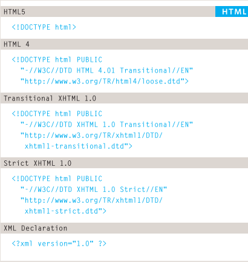
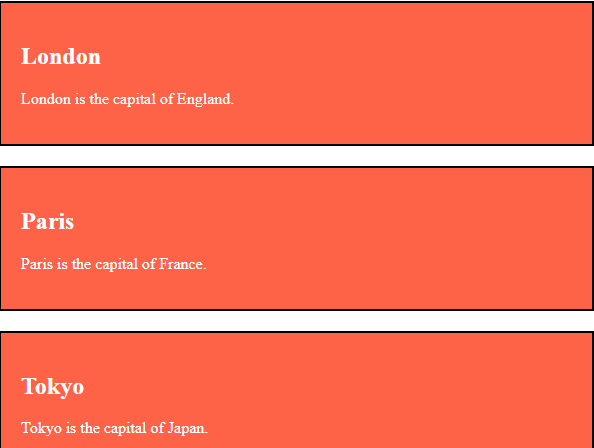
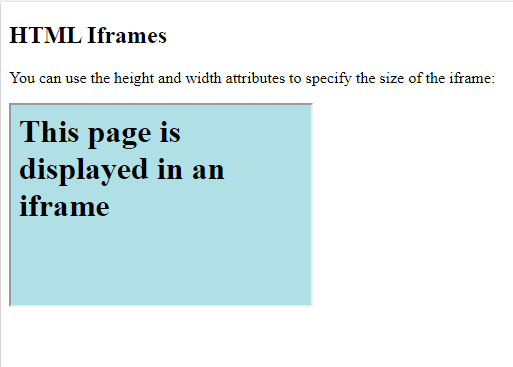
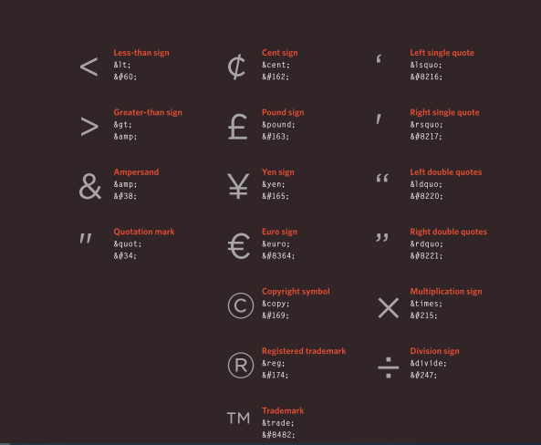

# Introductory HTML and JavaScript

There is many languages that used to built websites Like HTML, Javascript, CSS, paython,C++, etc...

But here we will talk about HTML and JS briefly to help you identfy th mot majorty of concepts, tool, and attribute.

I will also give you some examples to understand some concepts.

So without further ado lets start it...

## Topics
1. Introductry HTML
2. Introductry JavaScript

### Introductry HTML


In this topic i will cover with you the following subject:
* Structure 
* Extra Markup
* HTML5 Layout
* Process & Design

### structure
**Understand structure**
If you need to see webpage like below as below you have to use html with specific tags.
But remember that html just use to write content and doesn't have any access to design the page.


So what tags i have to use?in table below you will show all important tages in html so if you undeerstand how to use each tags you will master html easily 


But i think you will ask me how can i use them so i will give you an simple example:

```
<!DOCTYPE html>
<html>

<haed>Asac</head>

<body>
<h2>An Unordered HTML List</h2>

<ul>
  <li>Coffee</li>
  <li>Tea</li>
  <li>Milk</li>
</ul>  

<h2>An Ordered HTML List</h2>

<ol>
  <li>Coffee</li>
  <li>Tea</li>
  <li>Milk</li>
</ol> 

<p> My name is Bara'a </p>

</body>
</html>
```

As i promised you the example above include many example of html tages like:
1. body
2. list
3. heading (note that there is many size of head tages which are h1 h2 h3 h4 h5 h6 and they are used orderly in webpage wich mean the main head will be biggest one then h2 h3 ....)
4. paraghraph

The last thing i have to mention in this section is about the rules of writing of the tages:
1. Tags are often referred to as elements.
2. Tags usually come in pairs. The opening tag denotes the start of a piece of content; the closing tag denotes the end.
3. Opening tags can carry attributes, which tell us more about the content of that element.
4. Attributes require a name and a value.


It a game !! 

let's move to extra markdown

**Extra Markup**

As any sofware HTML was developed during last 2 decate , i will list these vision and i will show you the defferent between them by using picture.

Let’s see the significance of the individual Versions of Html in details-

1. HTML 1.0
The basic version of HTML has support for basic elements like text controls and images. This was the very basic version of HTML with less support for a wide range of HTML elements. It does not have rich features like styling and other things that were related to how content will be rendered in a browser.
The initial version of HTML does not provide support for tables, font support, etc like it provide us in the latest version.
We would also like to discuss that W3C did not exist before HTML 2.0 hence it does not show details about HTML 1.
2. HTML 2
HTML version 2.0 was developed in 1995 with basic intention of improving HTML version 1.0
Now a standard got started to develop so as to maintain common rules and regulations across different browsers. HTML 2.0 has improved a lot in terms of the markup tags. In HTML 2.0 version concept of form came into force. Forms were developed but still, it was having basic tags like text boxes, buttons, etc.
Also, the table came as an HTML tag. Now, in HTML tag 2.0 browsers also came with the concept of creating own layers of tags that were specific to the browser itself. W3C was also formed. The main intention of W3C is to maintain standard across different web browsers so that these browsers understand and render HTML tags in a similar manner.
3. HTML 3.2
It was developed in 1997. After HTML 2.0 was developed, the next version of HTML was 3.2
With version 3.2 of HTML, HTML tags were further improved. It is worth noting that because of W3C standard maintenance, the newer version of HTML was 3.2 instead of 3.
Now, HTML 3.2 has better support for new form elements. Another important feature what HTML 3.2 implemented was support for CSS. CSS stands for Cascading Style Sheet. It is CSS that provides features to make HTML tags look better on rendering it on browsers. CSS helps to style HTML elements.
With upgradation of browsers to HTML 3.2, the browser also supported for frame tags although HTML specifications still do not support frame markup tags.
4. HTML 4.01
It was developed in 1999 It extended the support of cascading styling sheets. In version 3.2, CSS were embedded in HTML page itself. Therefore, if the website has various web pages to apply to the style of each page, we must place CSS on each web page. Hence there was a repetition of the same block of CSS.
To overcome this thing, in version 4.01 concept of external styling sheet emerged. Under this concept, an external CSS file could be developed and this external styling file could be included in HTML itself. HTML 4.01 provided support for further new tags of HTML.
5. HTML5
This is the latest version of HTML. For a developer, it could be used in 2014. It came up with lots of HTML tags support. HTML5 provided support for new form elements like input element s of different types, geolocations support tags, etc.




but how we can add comment that i don't need to shown at the webpages and i want to use it just to communicate with my team.
it is so easy to add comment:
Notice that there is an exclamation point (!) in the start tag, but not in the end tag.

Note: Comments are not displayed by the browser, but they can help document your HTML source code.

You can add comments to your HTML source by using the following syntax:

```
<!-- Write your comments here -->
```

Example:
```
<!DOCTYPE html>
<html>
<body>

<!-- This is a comment -->
<p>This is a paragraph.</p>
<!-- Comments are not displayed in the browser -->

</body>
</html>
```

very well, but what about i you need metion to some element in your code to edit it what you have to use. it it so easy you can use id or class because the id and class attributes allow you to identify
particular elements.

The class attribute is often used to point to a class name in a style sheet. It can also be used by a JavaScript to access and manipulate elements with the specific class name.

In the following example we have three `<div>`elements with a class attribute with the value of "city". All of the three `<div>` elements will be styled equally according to the .city style definition in the head section:
```
<!DOCTYPE html>
<html>
<head>
<style>
.city {
  background-color: tomato;
  color: white;
  border: 2px solid black;
  margin: 20px;
  padding: 20px;
}
</style>
</head>
<body>

<div class="city">
<h2>London</h2>
<p>London is the capital of England.</p>
</div> 

<div class="city">
<h2>Paris</h2>
<p>Paris is the capital of France.</p>
</div>

<div class="city">
<h2>Tokyo</h2>
<p>Tokyo is the capital of Japan.</p>
</div>

</body>
</html>
```

As you see in the picture below the code will result like this in webpage 



but FYI there is one different between id and class: The only difference between them is that “id” is unique in a page and can only apply to at most one element, while “class” selector can apply to multiple elements.

also when you need to mention to id you have to write # 


An HTML iframe is used to display a web page within a web page.

Syntax

```
<iframe src="url" title="description">
```

Example:

```<!DOCTYPE html>
<html>
<body>

<h2>HTML Iframes</h2>
<p>You can use the height and width attributes to specify the size of the iframe:</p>

<iframe src="demo_iframe.htm" height="200" width="300" title="Iframe Example"></iframe>

</body>
</html>
```



There are some characters that are used in and reserved by HTML code. (For example, the left and right angled brackets.)



Therefore, if you want these characters to appear on your page you need to use what are termed "escape" characters (also known as escape codes or entity references). For example, to write a left angled bracket, you can use either `&lt;`. For an ampersand, you can use either `&amp;` or `&#38;`. There are also special codes that can be used to show
symbols such as copyright and trademark, currency symbols, mathematical characters, and some punctuation marks. For example, if you want to include a copyright symbol on a web page you can use either `&copy;` or `&#169;`. When using escape characters, it is important to check the page in your browser to ensure that the correct symbol shows up. This is because some fonts do not support all of these characters and you might therefore need to specify a different font for these characters in your CSS code.

About html5 layot is so easy to understand.
Websites often display content in multiple columns (like a magazine or a newspaper) 

HTML has several semantic elements that define the different parts of a web page: 

`<header>` - Defines a header for a document or a section
`<nav>` - Defines a set of navigation links
`<section>` - Defines a section in a document
`<article>` - Defines an independent, self-contained content
`<aside>` - Defines content aside from the content (like a sidebar)
`<footer>` - Defines a footer for a document or a section
`<details>` - Defines additional details that the user can open and close on demand
`<summary>` - Defines a heading for the `<details>` element


### Javascript

#### How JavaScript Makes Web pages More Interactive


***Javascript allow you to make web pae more interactive by accessing and modifying the content and markup used in the web pages while it is being viewed in the browser*** 

**1. ACCESS CONTENT**
     You can use JavaScript to select any element, attribute, or text from an
HTML page. For example:
- Select the text inside all of the `<hl> `elements on a page
- Select any elements that have a c 1 ass attribute with a value of note
- Find out what was entered into a text input whose id attribute has a value of ema i 1

**2. Modifying the content**
You can use JavaScript to add elements, attributes, and text to the page, or remove them. For example:
- Add a paragraph of text after the first `<hl>` element
- Change the value of c 1 ass attributes to trigger new CSS rules for those elements
- Change the size or position of an `<i mg> `element

**3. PROGRAM RULES**
You can specify a set of steps for the browser to follow (like a recipe), which allows it to access or change the content of a page. For example:
- A gallery script could check which image a user clicked on and display a larger version of that image.
- A mortgage calculator could collect values from a form, perform a ca lculation, and display repayments.
- An animation could check the dimensions of the browser window and move an image to the bottom of the viewable area (also known as the viewport).

**4. React ro event**

You can specify that a script should run when a specific event has occurred. For example, it could be run when:
- A button is pressed
- A link is clicked (or tapped) on
- A cursor hovers over an element
- Information is added to a form
- An interval of time has passed
- A web page has finished loading

### Data Types in JS


### Same main tools of the java script

***1. JavaScript Syntaxis***

   JavaScript syntax is the set of rules, how JavaScript programs are constructed:
```
<!DOCTYPE html>
<html>
<body>

<h2>JavaScript Statements</h2>

<p>A <b>JavaScript program</b> is a list of <b>statements</b> to be executed by a computer.</p>

<p id="demo"></p>

<script>
var x, y, z;  // Statement 1
x = 5;        // Statement 2
y = 6;        // Statement 3
z = x + y;    // Statement 4

document.getElementById("demo").innerHTML =
"The value of z is " + z + ".";  
</script>

</body>
</html>
```

***2. JavaScript Operators***

Assign values to variables and add them together:

```
<!DOCTYPE html>
<html>
<body>

<h2>JavaScript Operators</h2>

<p>x = 5, y = 2, calculate z = x + y, and display z:</p>

<p id="demo"></p>

<script>
var x = 5;
var y = 2;
var z = x + y;
document.getElementById("demo").innerHTML = z;
</script>

</body>
</html>
```

***3. Function***

A JavaScript function is a block of code designed to perform a particular task.
A JavaScript function is executed when "something" invokes it (calls it).

```<!DOCTYPE html>
<html>
<body>

<h2>JavaScript Functions</h2>

<p>This example calls a function which performs a calculation, and returns the result:</p>

<p id="demo"></p>

<script>
function myFunction(p1, p2) {
  return p1 * p2;
}
document.getElementById("demo").innerHTML = myFunction(4, 3);
</script>

</body>
</html>
```

***4. Conditional Statements***

Very often when you write code, you want to perform different actions for different decisions.
You can use conditional statements in your code to do this.
In JavaScript we have the following conditional statements:

- Use if to specify a block of code to be executed, if a specified condition is true
- Use else to specify a block of code to be executed, if the same condition is false
- Use else if to specify a new condition to test, if the first condition is false
- Use switch to specify many alternative blocks of code to be executed

```<!DOCTYPE html>
<html>
<body>

<p>Click the button to get a time-based greeting:</p>

<button onclick="myFunction()">Try it</button>

<p id="demo"></p>

<script>
function myFunction() {
  var greeting;
  var time = new Date().getHours();
  if (time < 10) {
    greeting = "Good morning";
  } else if (time < 20) {
    greeting = "Good day";
  } else {
    greeting = "Good evening";
  }
  document.getElementById("demo").innerHTML = greeting;
}
</script>

</body>
</html>
```

***5. Assignment Operators***

Assignment operators assign values to JavaScript variables.


***6. Window prompt() Method***

Display a prompt box which ask the user for her/his name, and output a message:

```
<!DOCTYPE html>
<html>
<body>

<p>Click the button to demonstrate the prompt box.</p>

<button onclick="myFunction()">Try it</button>

<p id="demo"></p>

<script>
function myFunction() {
  var person = prompt("Please enter your name", "Harry Potter");
  if (person != null) {
    document.getElementById("demo").innerHTML =
    "Hello " + person + "! How are you today?";
  }
}
</script>

</body>
</html>
```
