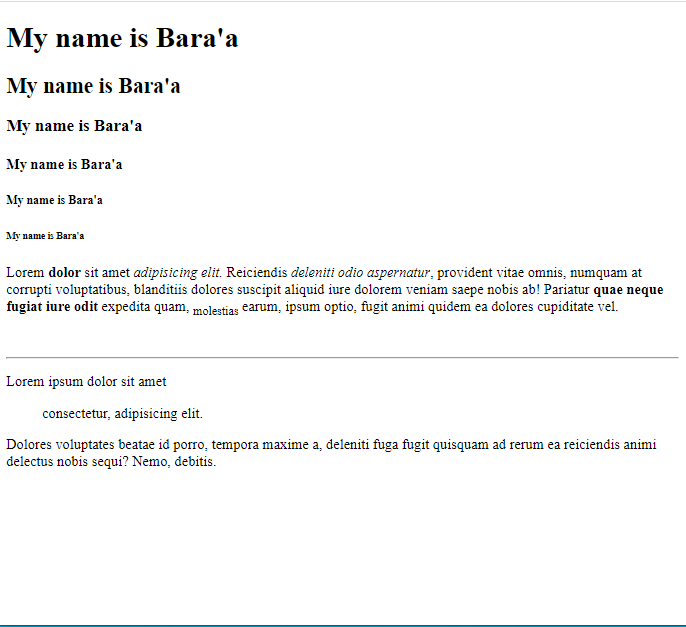
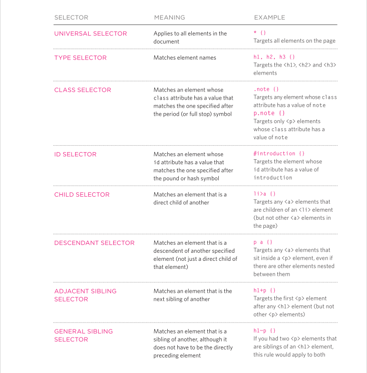

# HTML Text, CSS Introduction, and Basic JavaScript Instructions


Topics:
1. HTML text
2. Introduction CSS
3. Basic JavaScript instruction
4. Decisions and loops 

I think from last repo you had understand how to creat simple webpage by using html and js and here we will go through deeply to introduce the relations between three brothers html css and js 

lets tie belts and start...

## HTML text
At the begining we will talk about html text 

In this section we focus on how to add markup to the text that appears on your pages. You will learn about:
**Structural markup:** the elements that you can use to
describe both headings and paragraphs
**Semantic markup:** which provides extra information; such as where emphasis is placed in a sentence, that something you have written is a quotation (and who said it), the meaning of acronyms, and so on

we can summarize tags that used to edit of the text in one paragraph. 
then i will give you comprehensive example to make you fully under stand.


```
<!DOCTYPE html>
<html lang="en">

<head>
    <meta charset="UTF-8">
    <meta http-equiv="X-UA-Compatible" content="IE=edge">
    <meta name="viewport" content="width=device-width, initial-scale=1.0">
    <title>Document</title>
</head>

<body>
    <h1>My name is Bara'a</h1>
    <h2>My name is Bara'a</h2>
    <h3>My name is Bara'a</h3>
    <h4>My name is Bara'a</h4>
    <h5>My name is Bara'a</h5>
    <h6>My name is Bara'a</h6>
    <!-- in this pargrapg i will include all text tages edits -->
    <p>Lorem <b> dolor</b> sit amet <em>adipisicing elit.</em>  Reiciendis <i>deleniti odio aspernatur</i>, provident vitae
        omnis, numquam at corrupti voluptatibus, blanditiis dolores suscipit aliquid iure dolorem veniam saepe nobis ab!
        Pariatur <strong> quae neque fugiat iure odit</strong> expedita quam, <sub> molestias</sub> earum, ipsum optio, fugit animi
        quidem ea dolores cupiditate vel.</p>
        <br>
        <hr>
    <p>Lorem ipsum dolor sit amet <ul>consectetur, adipisicing elit.</ul> Dolores voluptates beatae id porro, tempora maxime a,
        deleniti fuga fugit quisquam ad rerum ea <strick>reiciendis animi delectus nobis sequi? Nemo,</strick> debitis.</p>
</body>

</html>
```



Also we have many of tags that usedin html like `<del>` and `<adress>` but they are doesn't used daily in your work 

##### Summary 

* HTML elements are used to describe the structure of the page (e.g. headings, subheadings, paragraphs).
* They also provide semantic information (e.g. where emphasis should be placed, the definition of any acronyms used, when given text is a quotation).


# Introduction CSS

If you like designs and shapes you will have fun here becuase we will talk about fun part in webpages developing.
In this section, we will look at how to make your web pages more attractive, controlling the design of them using CSS.
CSS allows you to create rules that specify how the content of an element should appear. For example, you can specify that the background of the page is cream, all paragraphs should appear in gray using the Arial typeface, or that all level one headings should be in a blue, italic, Times typeface.

CSS works by associating rules with HTML elements. These rules govern how the content of specified elements should be displayed. A CSS rule contains two parts: a selector and a declaration.


* Selectors indicate which element the rule applies to. The same rule can apply to more than one element if you separate the element names with commas.
* Declarations indicate how the elements referred to in the selector should be styled. Declarations are split into two parts (a property and a value), and are separated by a colon.

If you need to apply your design you have three ways that you can refer to them in the last repo:

1. inline
it will be inline leterly

```
<h1 style="color:blue;">A Blue Heading</h1>
```

2. internal 
by using style tage in head in html file 

```
<!DOCTYPE html>
<html>
<head>
<style>
body {
  background-color: linen;
}

h1 {
  color: maroon;
  margin-left: 40px;
}
</style>
</head>
<body>

<h1>This is a heading</h1>
<p>This is a paragraph.</p>

</body>
</html>
```

3. external
it is important to link html file with css file by use link tag in head of html as below 

```
<!DOCTYPE html>
<html>
<head>
<link rel="stylesheet" href="mystyle.css">
</head>
<body>

<h1>This is a heading</h1>
<p>This is a paragraph.</p>

</body>
</html>
```


```
body {
  background-color: lightblue;
}

h1 {
  color: navy;
  margin-left: 20px;
}
```

There are many different types of CSS selector that allow you to target rules to specific elements in an HTML document. The table on the opposite page introduces the most commonly used CSS selectors.

CSS selectors are case sensitive, so they must match element  names and attribute values exactly.



##### Summary 

* CSS treats each HTML element as if it appears inside its own box and uses rules to indicate how that element should look.
* Rules are made up of selectors (that specify the elements the rule applies to) and declarations (that indicate what these elements should look like).
* Different types of selectors allow you to target your rules at different elements.
* Declarations are made up of two parts: the properties of the element that you want to change, and the values of those properties. For example, the font-family property sets the choice of font, and the value arial specifies Arial as the preferred typeface.
* CSS rules usually appear in a separate document, although they may appear within an HTML page.

