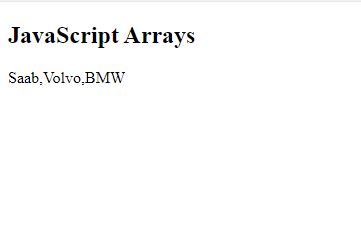

# Readings : HTML Lists, Control Flow with JS, and the CSS Box Model

Today our notes will be easy and vey simple so be relax, our section listed below

1. HTML lists
2. CSS Boxes
3. Array
4. Decision and loops

## HTML lists

There are lots of occasions when we need to use lists. HTML provides us with three different types:

1. Ordered lists are lists where each item in the list is numbered. For example, the list might be a set of steps for a recipe that must be performed in order, or a legal contract where each point needs to be identified by a section number.

Example

```
<!DOCTYPE html>
<html>
<body>

<h2>An ordered HTML list</h2>

<ol>
  <li>Coffee</li>
  <li>Tea</li>
  <li>Milk</li>
</ol>

</body>
</html>
```


2. Unordered lists are lists that begin with a bullet point (rather than characters that indicate order).

example

```
<!DOCTYPE html>
<html>
<body>

<h2>An unordered HTML list</h2>

<ul>
  <li>Coffee</li>
  <li>Tea</li>
  <li>Milk</li>
</ul>

</body>
</html>
```


3. Definition lists are made up of a set of terms along with the definitions for each of those terms.

```
<!DOCTYPE html>
<html>
<body>

<h2>A Description List</h2>

<dl>
  <dt>Coffee</dt>
  <dd>- black hot drink</dd>
  <dt>Milk</dt>
  <dd>- white cold drink</dd>
</dl>

</body>
</html>
```

**Summary**

- There are three types of HTML lists: ordered, unordered, and definition.
- Ordered lists use numbers.
- Unordered lists use bullets.
- Definition lists are used to define terminology.
- Lists can be nested inside one another.


## CSS Boxes

So will recognise many concepts about CSS boxes so please focus

**we will cover the following ideas**

- Controling size of box
- Box model for borders margins and padding
- Displaying and hiding boxes

**_Padding and margin:_** the most important things that you have to know in this boxing

as you see in he oic you can identify the meaning of both of them


**Explanation of the different parts:**

1. Content - The content of the box, where text and images appear
2. Padding - Clears an area around the content. The padding is transparent
3. Border - A border that goes around the padding and content
4. Margin - Clears an area outside the border. The margin is transparent

Lets take some examples to fully understand this idea:

```
div {
  background-color: lightgrey;
  width: 300px;
  border: 15px solid green;
  padding: 50px;
  margin: 20px;
}
```


**_Disaple and visible of elements_**

```
<ul>
chapter-13/visibility.html
<li>Home</li>
<li>Products</li>
<li class="coming-soon">Services</li>
<li>About</li>
<li>Contact</li>
</ul>
```

Suppose we need to disable class coming soon
you just use the following:

```
li.coming-soon {
visibility: hidden;}
```

**Inline box**

The display: inline-block Value
Compared to display: inline, the major difference is that display: inline-block allows to set a width and height on the element.
Also, with display: inline-block, the top and bottom margins/paddings are respected, but with display: inline they are not.
Compared to display: block, the major difference is that display: inline-block does not add a line-break after the element, so the element can sit next to other elements.
The following example shows the different behavior of display: inline, display: inline-block and display: block:

```
<!DOCTYPE html>
<html>
<head>
<style>
span.a {
  display: inline; /* the default for span */
  width: 100px;
  height: 100px;
  padding: 5px;
  border: 1px solid blue;
  background-color: yellow;
}

span.b {
  display: inline-block;
  width: 100px;
  height: 100px;
  padding: 5px;
  border: 1px solid blue;
  background-color: yellow;
}

span.c {
  display: block;
  width: 100px;
  height: 100px;
  padding: 5px;
  border: 1px solid blue;
  background-color: yellow;
}
</style>
</head>
<body>
```


**Summary**

1. CSS treats each HTML element as if it has its own box.
2. You can use CSS to control the dimensions of a box.
3. You can also control the borders, margin and padding for each box with CSS.
4. It is possible to hide elements using the display and visibility properties.
5. Block-level boxes can be made into inline boxes, and inline boxes made into block-level boxes.
6. Legibility can be improved by controlling the width of boxes containing text and the leading.
7. CSS3 has introduced the ability to create image borders and rounded borders.

## Arrays

An array is a special type of variable. It doesn't just store one value; it stores a list of values.

```
<!DOCTYPE html>
<html>
<body>

<h2>JavaScript Arrays</h2>

<p id="demo"></p>

<script>
var cars = new Array("Saab", "Volvo", "BMW");
document.getElementById("demo").innerHTML = cars;
</script>

</body>
</html>
```



## Switch

The switch statement is used to perform different actions based on different conditions.

Example

Syntax

```
switch(expression) {
  case x:
    // code block
    break;
  case y:
    // code block
    break;
  default:
    // code block
}
```

**This is how it works:**

The switch expression is evaluated once.
The value of the expression is compared with the values of each case.
If there is a match, the associated block of code is executed.
If there is no match, the default code block is executed.

Example

The getDay() method returns the weekday as a number between 0 and 6.

(Sunday=0, Monday=1, Tuesday=2 ..)

This example uses the weekday number to calculate the weekday name:

```
<p id="demo"></p>

<script>
var day;
switch (new Date().getDay()) {
  case 0:
    day = "Sunday";
    break;
  case 1:
    day = "Monday";
    break;
  case 2:
    day = "Tuesday";
    break;
  case 3:
    day = "Wednesday";
    break;
  case 4:
    day = "Thursday";
    break;
  case 5:
    day = "Friday";
    break;
  case  6:
    day = "Saturday";
}
document.getElementById("demo").innerHTML = "Today is " + day;
</script>

</body>
</html>
```


