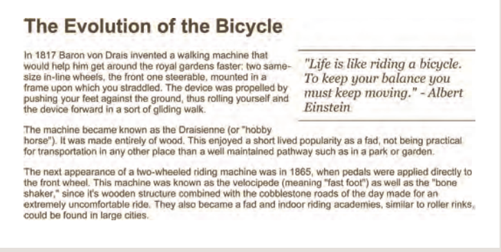

# HTML Links, JS Functions, and Intro to CSS Layout

It was very good to reach to this stage, so today i will provide you additional information about:

1. Html Links
2. Css layout
3. JS Functions methode and objects loops

## Html Links

Links are the defining feature of the web because they allow you to move from one web page to another — enabling the very idea of browsing or surfing.

**How to write links**

Links are created using the `<a>` element. Users can click on anything between the opening `<a>` tag and the closing `</a>` tag. You specify which page you want to link to using the href attribute.
as below


**Notes**

- The text between the opening `<a>` tag and closing `</a>` tag is known as link text. Where possible, your link text should explain where visitors will be taken if they click on it (rather than just saying "click here"). Below you can see the link to IMDB that was created on the previous page.

- Many people navigate websites by scanning the text for links. Clear link text can help visitors find what they want. This will give them a more positive
  impression of your site and may encourage them to visit it for longer. (It also helps people using screen reader software.)

- To write good link text, you can think of words people might use when searching for the page that you are linking to. (For example, rather than write "places to stay" you could use something more specific such as "hotels in New York.")

**Directory structure**

On larger websites it's a good idea to organize your code by placing the pages for each different section of the site into a new folder. Folders on a website are sometimes referred to as directories.


The root folder contains:
● A file called index.html which is the homepage for the entire site
● Individual folders for the movies, music and theatre sections of the site.

Each sub-directory contains:
● A file called index.html which is the homepage for that section
● A reviews page called reviews.html
● A listings page called listings.html (except for the DVD
section)
The movies section contains:
● A folder called cinema
● A folder called DVD.


**Email Link**

To create a link that starts up the user's email program and addresses an email to a specified email address, you use the `<a>` element. However, this time the value of the href attribute starts with mailto: and is followed by the email address you want the email to be sent to.

Syntax
`<a href="mailto:jon@example.org">Email Jon</a>`

**Opening links in a new wendow**

If you want a link to open in a new window, you can use the target attribute on the opening `<a>` tag. The value of this attribute should be Result \_blank.

syntax

`<a href="http://www.imdb.com" target="_blank">`

Example links

```
<html>
<head>
<title>Links</title>
</head>
<body>
<h1 id="top">Film Folk</h1>
<h2>Festival Diary</h2>
<p>Here are some of the film festivals we
will be attending this year.<br />Please
<a href="mailto:filmfolk@example.org">
contact us</a> if you would like more
information.</p>
<h3>January</h3>
<p><a href="http://www.sundance.org">
Sundance Film Festival</a><br />
Park City, Utah, USA<br />
20 - 30 January 2011</p>
<h3>February</h3>
<p><a href="http://www.tropfest.com">
Tropfest</a><br />
Sydney, Australia<br />
20 February 2011</p>
<!-- additional content -->
<p><a href="about.html">About Film Folk</a></p>
<p><a href="#top">Top of page</a></p>
</body>
</html>
```

**Summary**

- Links are created using the `<a>` element.
- The `<a>` element uses the href attribute to indicate
  the page you are linking to.
- If you are linking to a page within your own site, it is
  best to use relative links rather than qualified URLs.
- You can create links to open email programs with an
  email address in the "to" field.
- You can use the id attribute to target elements within
  a page that can be linked to.

## CSS layout

In this section we are going to look at how to control where each element sits on a page and how to create attractive page layouts.

**Buiding blocks**

CSS treats each HTML element as if it is in its own box. This box will either be a block-level box or an inline box.

Block-level boxes start on a new line and act as the main building blocks of any layout, while inline boxes flow between surrounding text. You can control how much space each box takes up by setting the width of the boxes (and sometimes the height, too). To separate boxes, you can use borders, margins, padding, and background colors.

1. Block-level elements
   start on a new line
   Examples include:
   `<h1> <p> <ul> <li>`

ٍ

2. inline elements
   flow in Between
   surrounding text
   Examples include:
   ` <b> <i>`


3. containing ElEmEnts
   If one block-level element sits inside another block-level element then the outer box is known as the containing or parent element. It is common to group a number of elements together inside a `<div>` (or other block-level) element. For example, you might group together all of the elements that form the header of a site (such as the logo and the main navigation). The `<div>` element that contains this group of elements is then referred to as the containing element.


4. ControLLing the position of eLements (width trick)

CSS has the following positioning schemes that allow you to control the layout of a page: normal flow, relative positioning, and absolute positioning. You specify the positioning scheme using the position property in CSS. You can also float elements using the float property.

- normal flow: Every block-level element appears on a new line, causing each item to appear lower down the page than the previous one. Even if you specify the width of the boxes and there is space for two elements to sit side-by- side, they will not appear next to each other. This is the default behavior (unless you tell the browser to do something else).

Example

```
Html
<body>
<h1>The Evolution of the Bicycle</h1>
<p>In 1817 Baron von Drais invented a walking
machine that would help him get around the
royal gardens faster...</p>
</body>

css
body {
width: 750px;
font-family: Arial, Verdana, sans-serif;
color: #665544;}
h1 {
background-color: #efefef;
padding: 10px;}
p {
width: 450px;}
```


- relative Positioning: This moves an element from the position it would be in normal flow, shifting it to the top, right, bottom, or left of where it would have been placed. This does not affect the position of surrounding elements; they stay in the position they would be in in normal flow.

```
Html
<body>
<h1>The Evolution of the Bicycle</h1>
<p>In 1817 Baron von Drais invented a walking
machine that would help him get around the
royal gardens faster...</p>
</body>

css
p.example {
position: relative;
top: 10px;
left: 100px;}
```


- Absolute Positioning: This positions the element in relation to its containing element. It is taken out of normal flow, meaning that it does not affect the position of any surrounding elements (as they simply ignore the space it would have taken up). Absolutely positioned elements move as users scroll up and down the page.aBsolute Positioning This positions the element in relation to its containing element. It is taken out of normal flow, meaning that it does not affect the position of any surrounding elements (as they simply ignore the space it would have taken up). Absolutely positioned elements move as users scroll up and down the page.

Example

```
<body>
<h1>The Evolution of the Bicycle</h1>
<p>In 1817 Baron von Drais invented a walking
machine that would help him get around the
royal gardens faster...</p>
</body>

h1 {
position: absolute;
top: 0px;
left: 500px;
width: 250px;}
p {
width: 450px;}
```


To indicate where a box should be positioned, you may also need to use **box offset** properties to tell the browser how far from the top or bottom and left or right it should be placed. (You will meet these when we introduce the positioning schemes on the following pages.)

- fixed Positioning: This is a form of absolute positioning that positions the element in relation to the browser window, as opposed to the containing element. Elements with fixed positioning do not affect the position of surrounding elements and they do not move when the user scrolls up or down the page.

```
html

<body>
<h1>The Evolution of the Bicycle</h1>
<p class="example">In 1817 Baron von Drais
invented a walking machine that would help him
get around the royal gardens faster...</p>
</body>

css
h1 {
position: fixed;
top: 0px;
left: 50px;
padding: 10px;
margin: 0px;
width: 100%;
background-color: #efefef;}
p.example {
margin-top: 100px;}
```


- floating elements: Floating an element allows you to take that element out of normal flow and position it to the far left or right of a containing box. The floated element becomes a block-level element around which other content can flow.

```
html
<h1>The Evolution of the Bicycle</h1>
<blockquote>"Life is like riding a bicycle.
To keep your balance you must keep moving." -
Albert Einstein</blockquote>
<p>In 1817 Baron von Drais invented a walking
machine that would help him get around the royal
gardens faster: two same-size in-line wheels, the
front one steerable, mounted in a frame ... </p>

css
blockquote {
float: right;
width: 275px;
font-size: 130%;
font-style: italic;
font-family: Georgia, Times, serif;
margin: 0px 0px 10px 10px;
padding: 10px;
border-top: 1px solid #665544;
border-bottom: 1px solid #665544;}
```



Trick: Using float ro place elements side-by-side
you have to play with width and hight of the elements.

```
html
<body>
<h1>The Evolution of the Bicycle</h1>
<p>In 1817 Baron von Drais invented a walking
machine that would help him get around...</p>
</body>
css
body {
width: 750px;
font-family: Arial, Verdana, sans-serif;
color: #665544;}
p {
width: 230px;
float: left;
margin: 5px;
padding: 5px;
background-color: #efefef;}
```


- Clear float

The clear property allows you to say that no element (within the same containing element) should touch the left or right- hand sides of a box.
The value can taken: right left none

Syntax:
`clear: left;}`

## Screen sizes

Different visitors to your site will have different sized screens that show different amounts of information, so your design needs to be able to work on a range of different sized screens.

We have two type of layout:

1. Liquid layout
2. Fixed width layout

**Summary**

- `<div>` elements are often used as containing elements to group together sections of a page.
- Browsers display pages in normal flow unless you specify relative, absolute, or fixed positioning.
- The float property moves content to the left or right of the page and can be used to create ulti-column layouts. (Floated items require a defined width.)
- Pages can be fixed width or liquid (stretchy) layouts.
- Designers keep pages within 960-1000 pixels wide, and indicate what the site is about within the top 600 pixels (to demonstrate its relevance without scrolling .
- Grids help create professional and flexible designs.
- CSS Frameworks provide rules for common tasks.
- You can include multiple CSS files in one page.

## Function methods and objects

Browsers require very detailed instructions about what we want them to do. Therefore, complex scripts can run to hundreds (even thousands) of lines. Programmers use functions, methods, and objects to organize their code.

This chapter is divided into three sections that introduce:

FUNCTIONS & METHODS: Functions consist of a
series of statements that have been grouped together because they perform a specific task. A method is the same as a function, except methods are created inside (and are part of) an object.

OBJECTS: in this section we learn how to create your own objects using JavaScript.

BUILT-IN OBJECTS: The browser comes with a set of objects that act like a toolkit for creating interactive web pages. This section introduces you to a number of built-in objects, which you will then see used throughout the rest of the book.

**Declaration of the function**

function declaration: To create a function, you give it a name and then write the statments needed to achieve its tasks inside the curly braces.


**Calling function**

haveing declared the fuction youcan then exutte all of the statnebts between curly barces wiith just one line of code.


**ANONYMOUS FUNCTIONS & FUNCTION EXPRESSIONS**

Function declation

A function declaration creates a function that you can call later in your code.

```
function area (width, height)
return width * height;
};
var size= area(3, 4) ;
```

FUNCTION EXPRESSION

If you put a function where the interpreter would expect to see an expression, then it is treated as an expression.

```
var ar ea = f unction(width, height) {
r eturn width * height;
} ;
var size = area(3, 4) ;
```

in a function expression, the function is not processed until the interpreter gets to that statement. This means you cannot call this function before the interpreter has discovered it. It also means that any code that appears up to that point could potentially alter what goes on inside this function.

**Pair programming work**

Atually after reading pairing programming project something stuck in my mind, and it is so benifit because:

1. Greater efficiency:In reality, when two people focus on the same code base, it is easier to catch mistakes in the making.

2. Engaged collaboration:When two programmers focus on the same code, the experience is more engaging and both programmers are more focused than if they were working alone.

3. Learning from fellow students:Everyone has a different approach to problem solving; working with a teammate can expose developers to techniques they otherwise would not have thought of

4. Social skills: Pair programming is great for improving social skills. When working with someone who has a different coding style, communication is key.
