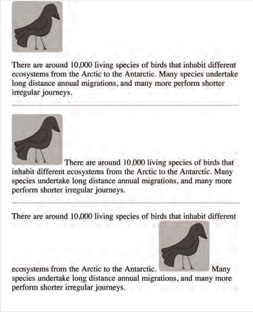
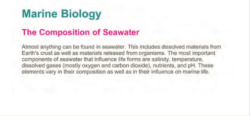
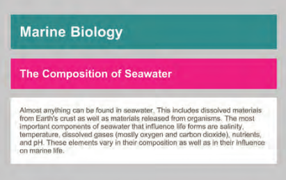
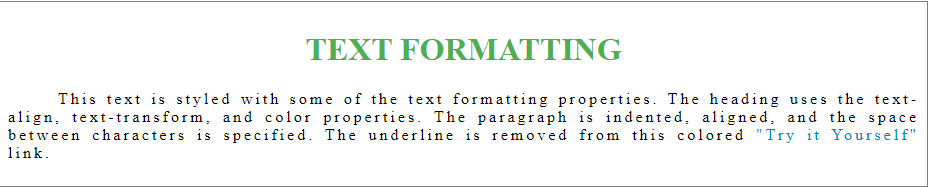
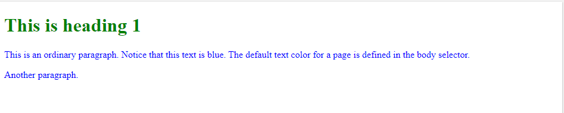
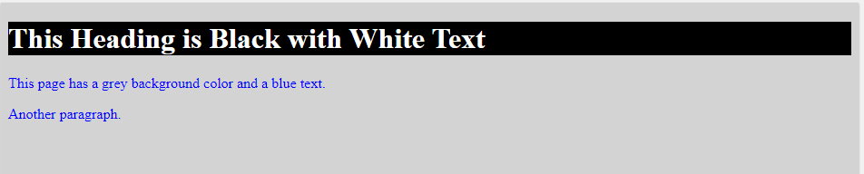

# HTML Images; CSS Color & Text

Today i will talk about following subjects:

1. Html images
2. css Color
3. css text

## Html Images

There are many reasons why you might want to add an image to a web page: you might want to include a logo, photograph, illustration, diagram, or chart.

**Choosing iamages for your site**

Stock photos

```
www.istockphoto.com
www.gettyimages.com
www.veer.com
www.sxc.hu
www.fotolia.com
```

How images should be

Be relevant
Convey information
Convey the right mood
Be instantly recognisable
Fit the color palette

**Soraging he images**

As a website grows, keeping images in a separate folder helps you understand how the site is organized. Here you can see an example of the files for a website; all of the images are stored in a folder called images.

**Adding images**

By using `` tag as below:

```

```

`src`
This tells the browser where it can find the image file. This will usually be a relative URL pointing to an image on your own site. (Here you can see that the images are in a child folder called images .

`alt`
This provides a text description of the image which describes the image if you cannot see it.

**hight and width of images**

Syntax

```

```

`height`
This specifies the height of the
image in pixels.

`width`
This specifies the width of the
image in pixels.

**place of the immage**

As the the place you put the link as below

```

<p>There are around 10,000 living species of birds
that inhabit different ecosystems from the
Arctic to the Antarctic. Many species undertake
long distance annual migrations, and many more
perform shorter irregular journeys.</p>
<hr />
<p>There are around 10,000 living
species of birds that inhabit different
ecosystems from the Arctic to the Antarctic. Many
species undertake long distance annual
migrations, and many more perform shorter
irregular journeys.</p>
<hr />
<p>There are around 10,000 living species of birds
that inhabit different ecosystems from the
Arctic to the Antarctic.Many species undertake long
distance annual migrations, and many more perform
shorter irregular journeys.</p>
```



**Three rules for creatIng images**
There are three rules to remember when you are creating images for your website which are summarized below. We go into greater detail on each topic over the next nine pages.

1. saVe Images In the rIght format Websites mainly use images in jpeg, gif, or png format. If you choose the wrong image format then your image might not look as sharp as it should and can make the web page slower to load.
2. saVe Images at the rIght sIze You should save the image at the same width and height it will appear on the website. If the image is smaller than the width or height that you have specified, the image can be distorted and stretched. If the image is larger than the width and height if you have specified, the image will take longer to display on the page.
3. use the CorreCt resolutIon Computer screens are made up of dots known as pixels. Images used on the web are also made up of tiny dots. Resolution refers to the number of dots per inch, and most computer screens only how web pages at 72 pixels per inch. So saving images at a higher resolution results in images that are larger than necessary and take longer to download.

**html5: figure and figure Caption**

`<figure>`
Images often come with captions. HTML5 has introduced a new `<figure> `element to contain images and their caption so that the two are associated. You can have more than one image inside the `<figure>` element as long as they all share the same caption.
Result
`<figcaption>`
The `<figcaption>` element has been added to HTML5 in order to allow web page authors to add a caption to an image. Before these elements were created there was no way to ssociate an `` element with its caption. Older browsers that do not understand HTML5 elements simply ignore the new elements and display the content of them.

## CSS color


Color can really bring your pages to life.

**Foreground color**

The color property allows you to specify the color of text inside an element. You can specify any color in CSS in one of three ways:

1. rgb values These express colors in terms of how much red, green and blue are used to make it up. For example: rgb(100,100,90)
2. hex Codes These are six-digit codes that represent the amount of red, green and blue in a color, preceded by a pound or hash # sign. For example: #ee3e80
3. Color names There are 147 predefined color names that are recognized by browsers. For example: DarkCyan

Example from css:

```
/* color name */
h1 {
color: DarkCyan;}
/* hex code */
h2 {
color: #ee3e80;}
/* rgb value */
p {
color: rgb(100,100,90);}
```



**Background color**

You can specify your choice of background color in the same three ways you can specify foreground colors: RGB values, hex codes, and color names (covered on the next page).

Example:

```
body {
background-color: rgb(200,200,200);}
h1 {
background-color: DarkCyan;}
h2 {
background-color: #ee3e80;}
p {
background-color: white;}
```



**Opacity**
CSS3 introduces the opacity property which allows you to specify the opacity of an element and any of its child elements. The value is a number between 0.0 and 1.0 (so a value of 0.5 is 50% opacity and 0.15 is 15%
opacity).

```
p.one {
background-color: rgb(0,0,0);
opacity: 0.5;}
p.two {
background-color: rgb(0,0,0);
background-color: rgba(0,0,0,0.5);}
```


**Summary**

- Color not only brings your site to life, but also helps convey the mood and evokes reactions.
- There are three ways to specify colors in CSS: RGB values, hex codes, and color names.
- Color pickers can help you find the color you want.
- It is important to ensure that there is enough contrast between any text and the background color (otherwise people will not be able to read your content).
- CSS3 has introduced an extra value for RGB colors to indicate opacity. It is known as RGBA.
- CSS3 also allows you to specify colors as HSL values, with an optional opacity value. It is known as HSLA.

## CSS Text


Text Transforming

Syntax
`text-transform: uppercase;`

Example

```
<!DOCTYPE html>
<html>
<head>
<style>
div {
  border: 1px solid gray;
  padding: 8px;
}

h1 {
  text-align: center;
  text-transform: uppercase;
  color: #4CAF50;
}

p {
  text-indent: 50px;
  text-align: justify;
  letter-spacing: 3px;
}

a {
  text-decoration: none;
  color: #008CBA;
}
</style>
</head>
<body>

<div>
  <h1>text formatting</h1>
  <p>This text is styled with some of the text formatting properties. The heading uses the text-align, text-transform, and color properties.
  The paragraph is indented, aligned, and the space between characters is specified. The underline is removed from this colored
  <a target="_blank" href="tryit.asp?filename=trycss_text">"Try it Yourself"</a> link.</p>
</div>

</body>
</html>
```



**Text Color**
The color property is used to set the color of the text. The color is specified by:

a color name - like "red"
a HEX value - like "#ff0000"
an RGB value - like "rgb(255,0,0)"
Look at CSS Color Values for a complete list of possible color values.

The default text color for a page is defined in the body selector.

Syntax

Text Color

```
body {
  color: blue;
}

h1 {
  color: green;
}
```

Background color

```
body {
  background-color: lightgrey;
  color: blue;
}

h1 {
  background-color: black;
  color: white;
}
```




**Text Alignment**
The text-align property is used to set the horizontal alignment of a text.

A text can be left or right aligned, centered, or justified.

The following example shows center aligned, and left and right aligned text (left alignment is default if text direction is left-to-right, and right alignment is default if text direction is right-to-left):

Syntax:

```
h1 {
  text-align: center;
}

h2 {
  text-align: left;
}

h3 {
  text-align: right;
}
```

When the text-align property is set to "justify", each line is stretched so that every line has equal width, and the left and right margins are straight (like in magazines and newspapers):

syntax:

```
div {
  text-align: justify;
}
```

Text Direction
The direction and unicode-bidi properties can be used to change the text direction of an element:

syntax:

```
p {
  direction: rtl;
  unicode-bidi: bidi-override;
}
```

Vertical Alignment
The vertical-align property sets the vertical alignment of an element.

This example demonstrates how to set the vertical alignment of an image in a text:

```
img.top {
  vertical-align: top;
}

img.middle {
  vertical-align: middle;
}

img.bottom {
  vertical-align: bottom;
}
```

**Summary**

- There are properties to control the choice of font, size, weight, style, and spacing.
- There is a limited choice of fonts that you can assume most people will have installed.
- If you want to use a wider range of typefaces there are several options, but you need to have the right license to use them.
- You can control the space between lines of text, individual letters, and words. Text can also be aligned to the left, right, center, or justified. It can also be indented.
- You can use pseudo-classes to change the style of an element when a user hovers over or clicks on text, or when they have visited a link.
