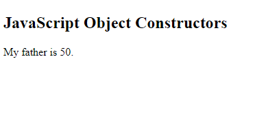
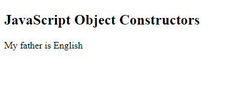
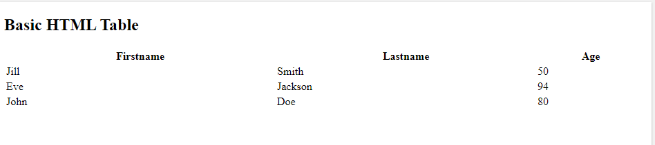

# HTML Tables; JS Constructor Functions

Example

```
<!DOCTYPE html>
<html>
<body>

<h2>JavaScript Object Constructors</h2>

<p id="demo"></p>

<script>
// Constructor function for Person objects
function Person(first, last, age, eye) {
  this.firstName = first;
  this.lastName = last;
  this.age = age;
  this.eyeColor = eye;
}

// Create a Person object
var myFather = new Person("John", "Doe", 50, "blue");

// Display age
document.getElementById("demo").innerHTML =
"My father is " + myFather.age + ".";
</script>

</body>
</html>
```



## Object Types (Blueprints) (Classes)

The examples from the previous chapters are limited. They only create single objects.

Sometimes we need a "blueprint" for creating many objects of the same "type".

The way to create an "object type", is to use an object constructor function.

In the example above, function Person() is an object constructor function.

## The this Keyword

In JavaScript, the thing called this is the object that "owns" the code.

The value of this, when used in an object, is the object itself.

In a constructor function this does not have a value. It is a substitute for the new object. The value of this will become the new object when a new object is created.

## Adding a Property to an Object

Adding a new property to an existing object is easy:

```
<!DOCTYPE html>
<html>
<body>

<h2>JavaScript Object Constructors</h2>

<p id="demo"></p>

<script>
// Constructor function for Person objects
function Person(first, last, age, eye) {
  this.firstName = first;
  this.lastName = last;
  this.age = age;
  this.eyeColor = eye;
}

// Create 2 Person objects
var myFather = new Person("John", "Doe", 50, "blue");
var myMother = new Person("Sally", "Rally", 48, "green");

// Add nationality to first object
myFather.nationality = "English";

// Display nationality
document.getElementById("demo").innerHTML =
"My father is " + myFather.nationality;
</script>

</body>
</html>
```



## Did You Know?

As you can see above, JavaScript has object versions of the primitive data types String, Number, and Boolean. But there is no reason to create complex objects. Primitive values are much faster.

```
ALSO:

Use object literals {} instead of new Object().

Use string literals "" instead of new String().

Use number literals 12345 instead of new Number().

Use boolean literals true / false instead of new Boolean().

Use array literals [] instead of new Array().

Use pattern literals /()/ instead of new RegExp().

Use function expressions () {} instead of new Function()
```

## Summary

1. The browser represents the page using a DOM tree.
2. DOM trees have four types of nodes: document nodes,element nodes, attribute nodes, and text nodes.
3. You can select element nodes by their id or cl ass attributes, by tag name, or using CSS selector syntax.
4. Whenever a DOM query can return more than one node, it will always return a Nadel i st.
5. From an element node, you can access and update its content using properties such as textContent and i nnerHTML or using DOM manipulation techniques.
6. An element node can contain multiple text nodes and child elements that are siblings of each other.
7. In older browsers, implementation of the DOM is inconsistent (and is a popular reason for using jQuery).
8. Browsers offer tools for viewing the DOM tree .

## Define an HTML Table

The `<table>` tag defines an HTML table.

Each table row is defined with a `<tr>` tag. Each table header is defined with a `<th>` tag. Each table data/cell is defined with a `<td> `tag.

By default, the text in `<th>` elements are bold and centered.
`By default, the text in`<td>` elements are regular and left-aligned.

```
<!DOCTYPE html>
<html>
<body>

<h2>Basic HTML Table</h2>

<table style="width:100%">
  <tr>
    <th>Firstname</th>
    <th>Lastname</th>
    <th>Age</th>
  </tr>
  <tr>
    <td>Jill</td>
    <td>Smith</td>
    <td>50</td>
  </tr>
  <tr>
    <td>Eve</td>
    <td>Jackson</td>
    <td>94</td>
  </tr>
  <tr>
    <td>John</td>
    <td>Doe</td>
    <td>80</td>
  </tr>
</table>

</body>
</html>
```


