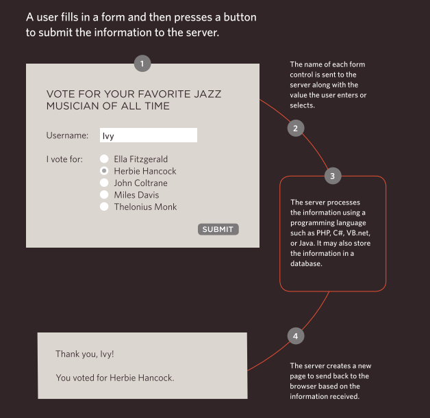

# Forms and JS Events

## HTML

**Why Forms?**
The best known form on the web is probably the search box that sits right in the middle of Google's homepage.

**Form Controls**

**HOW Forms Work**

**Summary**

1. Whenever you want to collect information from visitors you will need a form, which lives inside a `<form>` element.
2. Information from a form is sent in name/value pairs.
3. Each form control is given a name, and the text the
   user types in or the values of the options they select are sent to the server.
4. HTML5 introduces new form elements which make it
   easier for visitors to fill in forms.

## CSS

**styLing Forms**

Nobody I know enjoys filling in forms, so if you can make yours look more attractive and easier to use, more people are likely to fill it in. Also, when you come to look at a form in a few different browsers (as shown on the right), you will see that each browser displays them differently.
CSS is commonly used to control the appearance of form elements. This is both to make them more attractive and to make them more consistent across different browsers

**Summary**

1. In addition to the CSS properties covered in other
   chapters which work with the contents of all elements,
   there are several others that are specifically used to
   control the appearance of lists, tables, and forms.
2. List markers can be given different appearances
   using the list-style-type and list-style image
   properties.
3. Table cells can have different borders and spacing in
   different browsers, but there are properties you can
   use to control them and make them more consistent.
4. Forms are easier to use if the form controls are
   vertically aligned using CSS.
5. Forms benefit from styles that make them feel more
   interactive.

## Event

1. The browser represents the page using a DOM tree.
2. DOM trees have four types of nodes: document nodes, element nodes, attribute nodes, and text nodes. You can select element nodes by their id or cl assattributes, by tag name, or using CSS selector syntax.
3. Whenever a DOM query can return more than onenode, it will always return a Nadel i st.
4. From an element node, you can access and update its content using properties such as textContent and i nnerHTML or using DOM manipulation techniques.
5. An element node can contain multiple text nodes and child elements that are siblings of each other. In older browsers, implementation of the DOM is inconsistent (and is a popular reason for using jQuery .
6. Browsers offer tools for viewing the DOM tree .
