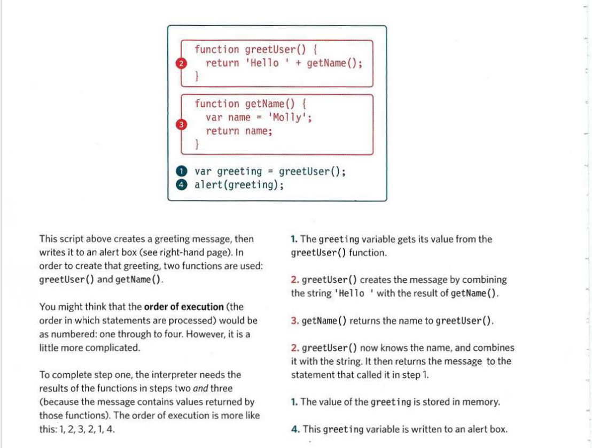
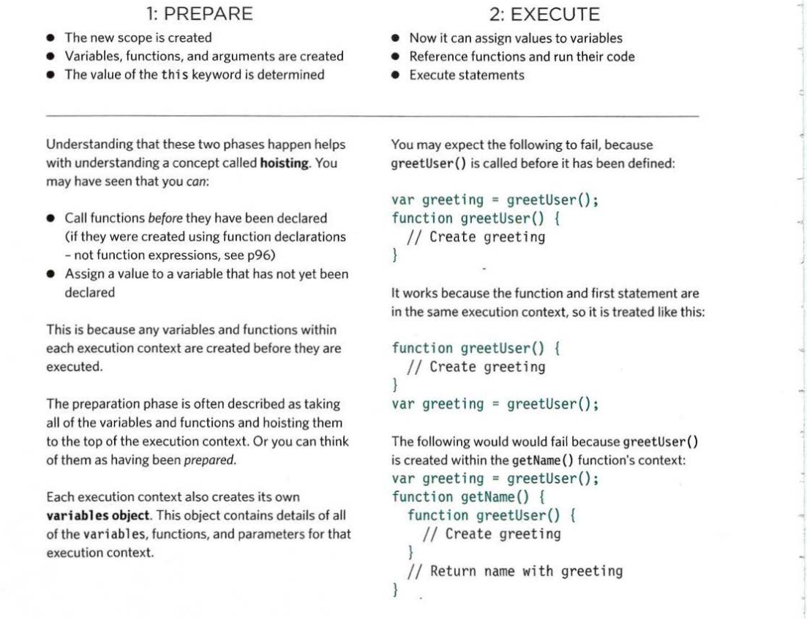
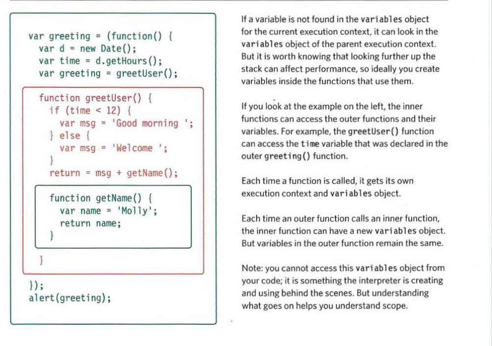
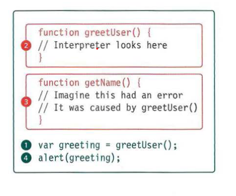

# ERRORS AND DEBIGGING

JavaScript can be hard to learn and everyone makes mistakes when writing it. This chapter will help you learn how to find the errors in your code. It will also teach you how to write scripts that deal with potential errors gracefully.

When writing a long script, nobody gets everything right in their first attempt. The error messages that a browser gives look cryptic at fi rst, but they can help you determine what went wrong in your JavaScript and how to fix it. In this note you will learn about:

1. THE CONSOLE & DEV TOOLS: Tools built into the browser that help you hunt for errors.
2. COMMON PROBLEMS: Common sources of errors, and how to solve them.
3. HANDLING ERRORS How code can deal with potential errors gracefully.

To find the source of an error, it helps to know how scripts are processed. The order in which statements are executed can be complex; some tasks cannot complete until another statement or function has been run:

### EXECUTION CONTEXTS

The JavaScript interpreter uses the concept of execution contexts. There is one global execution context; plus, each function creates a new new execution context. They correspond to variable scope.

EXECUTION CONTEXT
Every statement in a script lives in one of three
execution contexts:

1. GLOBAL CONTEXT
   Code that is in the script, but not in a function. There is only one global context in any page.
2. FUNCTION CONTEXT
   Code that is being run within a function.
   Each function has its own function context.
3. EVAL CONTEXT (NOT SHOWN)
   Text is executed like code in an internal function
   called eva l {) (which is not covered in this book).

## EXECUTION CONTEXT & HOISTING

## UNDERSTANDING SCOPE

In the interpreter, each execution context has its own variables object. It holds the variables, functions, and parameters available within it. Each execution context can also access its parent's variables object.

## UNDERSTANDING ERRORS

If a JavaScript statement generates an error, then it throws an exception. At that point, the interpreter stops and looks for exception-handling code.

