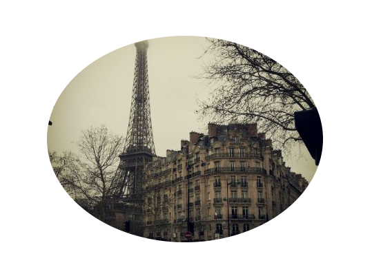
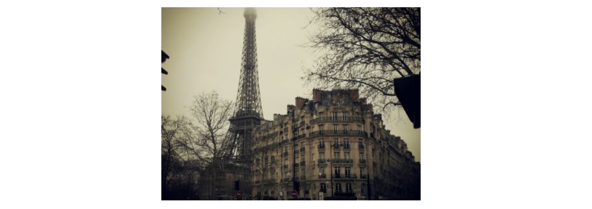
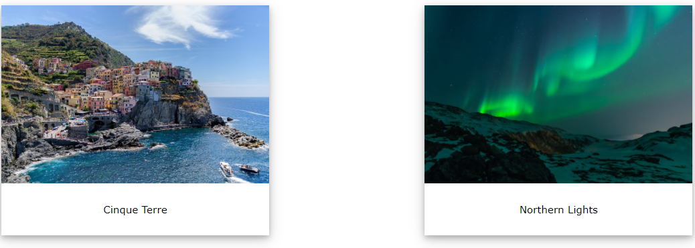
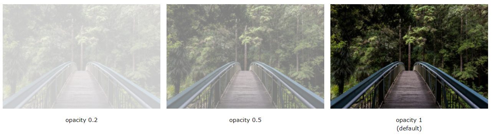

# Audio, Video, Images


There is many features can be used to design your webpage such as:

1. Rounded image
   Use the `border-radius` property to create rounded images:

Example:

```
<!DOCTYPE html>
<html>
<head>
<style>
img {
  border-radius: 8px;
}
</style>
</head>
<body>

<h2>Rounded Images</h2>
<p>Use the border-radius property to create rounded images:</p>


</body>
</html>
```



2. Thumbnail images

Use the `border` property to create thumbnail images.

```
img {
  border: 1px solid #ddd;
  border-radius: 4px;
  padding: 5px;
  width: 150px;
}


```

3. responsive images

Responsive images will automatically adjust to fit the size of the screen.

Resize the browser window to see the effect

```
img {
  max-width: 100%;
  height: auto;
}
```

4. center an imag

To center an image, set left and right margin to auto and make it into a `block` element:

```
img {
  display: block;
  margin-left: auto;
  margin-right: auto;
  width: 50%;
}
```



5. Polaroid images/card

Exmple:

```
div.polaroid {
  width: 80%;
  background-color: white;
  box-shadow: 0 4px 8px 0 rgba(0, 0, 0, 0.2), 0 6px 20px 0 rgba(0, 0, 0, 0.19);
}

img {width: 100%}

div.container {
  text-align: center;
  padding: 10px 20px;
}
```



6. Transparent Image

The opacity property can take a value from 0.0 - 1.0. The lower value, the more transparent:

```
img {
  opacity: 0.5;
}
```



7. Image Text
   How to position text in an image:

```
.center {
  position: absolute;
  top: 50%;
  left: 50%;
  transform: translate(-50%, -50%);
  font-size: 18px;
```

8. Image Filters
   The CSS filter property adds visual effects (like blur and saturation) to an element.

Example:

```
img {
  filter: grayscale(100%);
}
```

9. Image Hover Overlay

```
.container:hover .overlay {
  opacity: 1;
}
```

10. Flip an Image

```
img:hover {
  transform: scaleX(-1);
}
```

11. Responsive Image Gallery

```
.responsive {
  padding: 0 6px;
  float: left;
  width: 24.99999%;
}

@media only screen and (max-width: 700px){
  .responsive {
    width: 49.99999%;
    margin: 6px 0;
  }
}

@media only screen and (max-width: 500px){
  .responsive {
    width: 100%;
  }
}
```

12. Image Modal (Advanced)

This is an example to demonstrate how CSS and JavaScript can work together.

First, use CSS to create a modal window (dialog box), and hide it by default.

Then, use a JavaScript to show the modal window and to display the image inside the modal, when a user clicks on the image:

Example:

```
// Get the modal
var modal = document.getElementById('myModal');

// Get the image and insert it inside the modal - use its "alt" text as a caption
var img = document.getElementById('myImg');
var modalImg = document.getElementById("img01");
var captionText = document.getElementById("caption");
img.onclick = function(){
  modal.style.display = "block";
  modalImg.src = this.src;
  captionText.innerHTML = this.alt;
}

// Get the <span> element that closes the modal
var span = document.getElementsByClassName("close")[0];

// When the user clicks on <span> (x), close the modal
span.onclick = function() {
  modal.style.display = "none";
```

### Summary

- You can specify the dimensions of images using CSS.
- This is very helpful when you use the same sized images on several pages of your site.
- Images can be aligned both horizontally and vertically using CSS.
- You can use a background image behind the box created by any element on a page.
- Background images can appear just once or be repeated across the background of the box.
- You can create image rollover effects by moving the background position of an image.
- To reduce the number of images your browser has to load, you can create image sprites.
