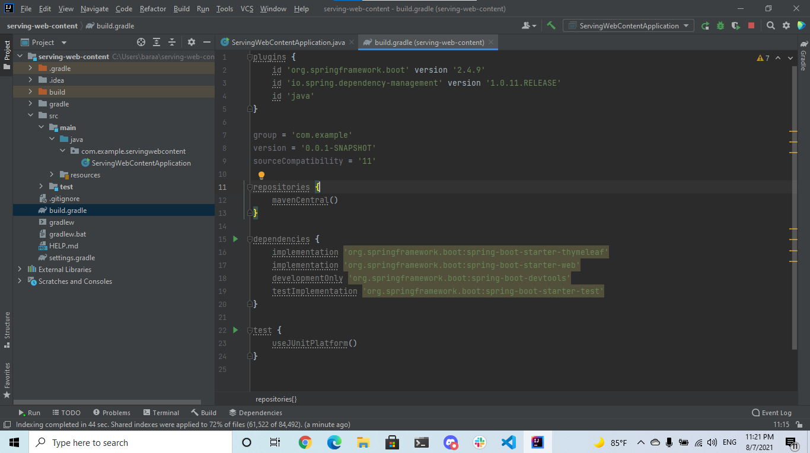

# Spring

## Serving Web Content with Spring MVC

To craete Hello world website with spring thier is some of requirment  

1. A favorite text editor or IDE

2. JDK 1.8 or later

3. Gradle 4+ or Maven 3.2+

4. You can also import the code straight into your IDE:

5. Spring Tool Suite (STS)

6. IntelliJ IDEA

### Starting with Spring Initializr

If you use Gradle, visit the Spring Initializr to generate a new project with the required dependencies (Spring Web, Thymeleaf, and Spring Boot DevTools).

The following listing shows the build.gradle file that is created when you choose Gradle:




### Create a Web Controller

In Spring’s approach to building web sites, HTTP requests are handled by a controller. You can easily identify the controller by the @Controller annotation. In the following example, GreetingController handles GET requests for /greeting by returning the name of a View (in this case, greeting). A View is responsible for rendering the HTML content. The following listing (from src/main/java/com/example/servingwebcontent/GreetingController.java) shows the controller:

```
package com.example.servingwebcontent;

import org.springframework.stereotype.Controller;
import org.springframework.ui.Model;
import org.springframework.web.bind.annotation.GetMapping;
import org.springframework.web.bind.annotation.RequestParam;

@Controller
public class GreetingController {

	@GetMapping("/greeting")
	public String greeting(@RequestParam(name="name", required=false, defaultValue="World") String name, Model model) {
		model.addAttribute("name", name);
		return "greeting";
	}

}
```

The implementation of the method body relies on a view technology (in this case, Thymeleaf) to perform server-side rendering of the HTML. Thymeleaf parses the greeting.html template and evaluates the th:text expression to render the value of the ${name} parameter that was set in the controller.The following listing (from src/main/resources/templates/greeting.html) shows the greeting.html template: 

```
<!DOCTYPE HTML>
<html xmlns:th="http://www.thymeleaf.org">
<head> 
    <title>Getting Started: Serving Web Content</title> 
    <meta http-equiv="Content-Type" content="text/html; charset=UTF-8" />
</head>
<body>
    <p th:text="'Hello, ' + ${name} + '!'" />
</body>
</html>
```

### Spring Boot Devtools
A common feature of developing web applications is coding a change, restarting your application, and refreshing the browser to view the change. This entire process can eat up a lot of time. To speed up this refresh cycle, Spring Boot offers with a handy module known as spring-boot-devtools. Spring Boot Devtools:

1. Enables hot swapping.

2. Switches template engines to disable caching.

2. Enables LiveReload to automatically refresh the browser.

4. Other reasonable defaults based on development instead of production.

## Spring MVC and Thymeleaf: how to access data from templates

In a typical Spring MVC application, @Controller classes are responsible for preparing a model map with data and selecting a view to be rendered. This model map allows for the complete abstraction of the view technology and, in the case of Thymeleaf, it is transformed into a Thymeleaf context object (part of the Thymeleaf template execution context) that makes all the defined variables available to expressions executed in templates.

1. Spring model attributes
Spring MVC calls the pieces of data that can be accessed during the execution of views model attributes. The equivalent term in Thymeleaf language is context variables.

2. Request parameters
Request parameters can be easily accessed in Thymeleaf views. Request parameters are passed from the client to server

3. Session attributes
Or by using #session, that gives you direct access to the javax.servlet.http.HttpSession object: ${#session.getAttribute('mySessionAttribute')}

4. ServletContext attributes
The ServletContext attributes are shared between requests and sessions. In order to access ServletContext attributes in Thymeleaf you can use the #servletContext.

5. Spring beans
refers to a Spring Bean registered at your context