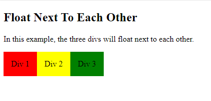
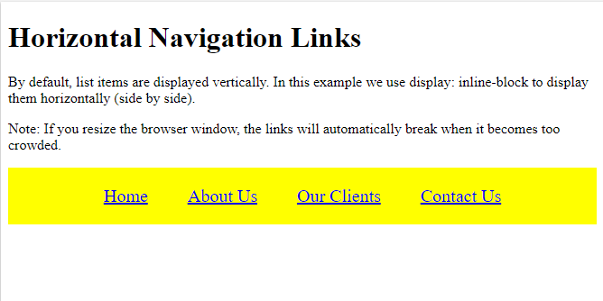

# CSS Intro


### What the differace between CSS and HTML 

In this article i will share what is HTML and CSS and how to implement in web development.


What is CSS?
CSS is a Cascading Style Sheet.it describes how HTML elements are to be displayed on screen,through this we can change the presentation and not the structure.Declaration should be in property :value pair.Like HTML there are lots of properties in Css too.

CSS Code
CSS Syntax or CSS Code is written in style tag or external css file. CSS Syntax is started with CSS Selector followed by declaration block, i.e. { }. Inside declaration block, property:value pair is used. Colon : is used to separate property and value. To add next property value pair, use ; semi-colon. Only last semi-colon is option in declaration block. CSS syntax is not case-sensitive, but it is recommended to prefer lowercases


How to link CSS with HTML?
CSS can be added into HTML in 3 ways:

+ Inline
+ Internal
+ External.

Inline: The Inline style is specific to the tag itself. The inline style uses the HTML “style” attribute to style a specific tag. This is not recommended, as every CSS change has to be made in every tag that has the inline style applied to it. The Inline style is good for one an individual CSS change that you do not use repeatedly through the site.


```
<body>
<p style="color:red;margin-left:30px;">This is paragraph</p>
</body>
Internal:An internal stylesheet holds the CSS code for the webpage in the head section of the particular file. This makes it easy to apply styles like classes or id’s in order to reuse the code.
<head> 
<style type="text/css">  
h1 {color:blue;}  
h2 {color:red;}  
p {color:green;} 
</style>  
</head>
```


+ External:The External Stylesheet is a .css file that you link your website to. This makes it so that what ever you change in the .css sheet, will effect every page in your website. This prevents you from having to make many code changes in each page. This is for “global” site changes.


```
<head>
<link rel="stylesheet" type="text/css" href="style.css" />
</head>
```


+ In the below example you can find out how useful really the css is!


***Exampes***

1. CSS Layout - float and clear
The CSS float property specifies how an element should float.
The CSS clear property specifies what elements can float beside the cleared element and on which side.

```
<!DOCTYPE html>
<html>
<head>
<style>
div {
  float: left;
  padding: 15px; 
}

.div1 {
  background: red;
}

.div2 {
  background: yellow;
}

.div3 {
  background: green;
}
</style>
</head>
<body>

<h2>Float Next To Each Other</h2>

<p>In this example, the three divs will float next to each other.</p>

<div class="div1">Div 1</div>
<div class="div2">Div 2</div>
<div class="div3">Div 3</div>

</body>
</html>
```



Using inline-block to Create Navigation Links
One common use for display: inline-block is to display list items horizontally instead of vertically. The following example creates horizontal navigation links:


```
<!DOCTYPE html>
<html>
<head>
<style>
.nav {
  background-color: yellow; 
  list-style-type: none;
  text-align: center;
  margin: 0;
  padding: 0;
}

.nav li {
  display: inline-block;
  font-size: 20px;
  padding: 20px;
}
</style>
</head>
<body>

<h1>Horizontal Navigation Links</h1>
<p>By default, list items are displayed vertically. In this example we use display: inline-block to display them horizontally (side by side).</p>
<p>Note: If you resize the browser window, the links will automatically break when it becomes too crowded.</p>

<ul class="nav">
  <li><a href="#home">Home</a></li>
  <li><a href="#about">About Us</a></li>
  <li><a href="#clients">Our Clients</a></li>  
  <li><a href="#contact">Contact Us</a></li>
</ul>

</body>
</html>
```




And more amd more application tat can implemented in CSS files to reach to nice design fro your webpage like:

1. Padding 
2. Tables 
3. Backgroung-color 
4. Text type
